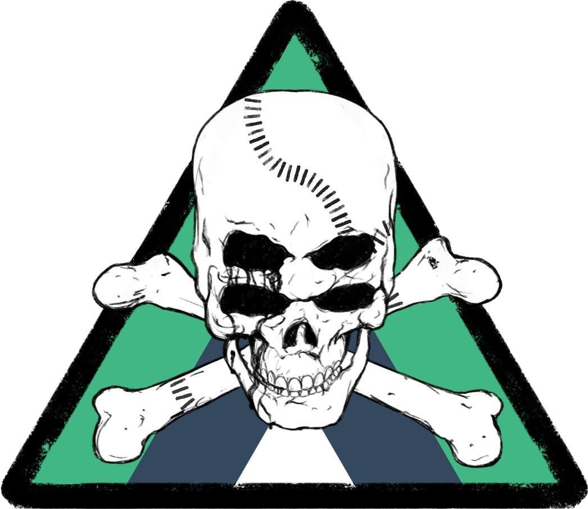

<p align="center">
<a href="https://samuelebarbiera.github.io/venmjs/"></a>
</p>
<p align="center">
  <a aria-label="License" href="https://github.com/SamueleBarbiera/Venmjs/blob/0.0.6/LICENSE.md">
    
  </a>
  <a aria-label="NPM version" href="https://www.npmjs.com/package/venmjs">
    
  </a>
</p>
<h1>This package can be used on Windows & Linux</h1>
<h1>(Mac is still on the testing phase)</h1>

## This CLI was tested on these OS
- Windows 10 - Linux (Ubuntu 20.04 LTS) - MacOS (Big Sur 11.5)

<h3>
This is a tool 🔧 that can be installed in your terminal at any time ⛏️ ,it was made for beginners and even for experts... for his utilities and his simple creation process 🧨. Every web developer knows how frustrating is to deal with the creation of a new project... 👀 and we even know that we pretty lazy, so I came up with this idea 💡
</h3>

# Quick starting point 🔮

### 👇 Installation 👇 
```bash
npm i -g venmjs                 (WINDOWS USERS)
sudo i -g venmjs --unsafe-perm  (MAC & LINUX USERS)
```

###  👇 Creation of a new project 👇
```bash
venm create <appname>
```

# 👇 Venm-cli offers the commands listed below 👇
-   create <appname> 👉 Create a Fullstack Project (Client && Server) 🚀 [SEMISTABLE ✅🚧]
-   deploy 👉 Deploy the webapp on a cloud platform of choice 🌐 [SEMISTABLE ✅🚧]
-   dockerize 👉 Create a multicontainer for your app with Docker 🐳 [STABLE ✅]
-   start 👉 Start the client side or the server side locally 🏁 [STABLE ✅]
-   devops 👉 Automate option is available 🔰 [ UNSTABLE ⛔⏳ ]
-   build 👉 Build folder for production 🏠 [ UNSTABLE ⛔⏳ ]
-   dep 👉 Install dependencies 🧰 [ UNSTABLE ⛔⏳ ]
-   test 👉 Testing phase 🔬 [ UNSTABLE ⛔⏳ ]

# Accessible fullstack projects to create ✒️
- [**MEVN**]  [Mongodb - Express - Mobile/Ssr/Ssg/MultiPlatform/Vue - Nodejs - GraphQL/RestAPI]
- [**MYEVN**] [MySQL - Express - Mobile/Ssr/Ssg/MultiPlatform/Vue - Nodejs - GraphQL/RestAPI]
- [**MLVN**]  [Mongodb - Laravel - Mobile/Ssr/Ssg/MultiPlatform/Vue - Nodejs - RestAPI]
- [**MYLVN**] [MySQL - Laravel - Mobile/Ssr/Ssg/MultiPlatform/Vue - Nodejs - GraphQL/RestAPI]

# Installation & Prerequisite (to run the venm-cli) ⚗️
## General
-   [**Nodejs**](https://nodejs.org/en/) A JavaScript run-time environment that executes JavaScript code on the browser
-   [**Npm**](https://www.npmjs.com/) is a package manager for the JavaScript programming language.
-   [**Git**](https://git-scm.com/) is a version control system for tracking changes in computer files
-   [**Yarn**](https://yarnpkg.com/getting-started/install) a package manager that doubles down as project manager
## Os Terminal
-   [**Wt**](https://www.microsoft.com/it-it/p/windows-terminal/9n0dx20hk701?activetab=pivot:overviewtab) Windows Cmd [using Npm]
-   [**Cmd**](https://brew.sh/) MacOS Cmd [using Homebrew with Brew] / [**XCode**](https://developer.apple.com/xcode/) MacOS Dev Env
-   [**Bash**](https://www.dummies.com/computers/operating-systems/linux/common-linux-commands/) Linux Cmd [using Apt]


# Optional Prerequisite (use every cmd available) 📦

## Frontend ⚡
### Mobile
-   [**Ionic**](https://quasar.dev/) Mobile js framework for Vuejs `npm i -g @ionic/cli@latest` 
-   [**Cordova**](https://quasar.dev/) Cordova/Native Ionic implementation `npm i -g @ionic/cli@latest native-run cordova-res` 
-   [**VueNative**](https://vue-native.io/docs/installation.html) Mobile framework for Vuejs `npm i --global vue-native-cli` 
-   [**Expo-cli**](https://vue-native.io/docs/installation.html) Expo-cli implementation in Vuenative`npm i --global expo-cli`

### Ssr
-   [**Nuxtjs**](https://nuxtjs.org/docs/2.x/get-started/installation) `npm i nuxt && npm i -g create-nuxt-app`
-   [**Quasar**](https://quasar.dev/) SSR framework for Vuejs `npm i -g @quasar/cli`

### Ssg
-   [**Vuepress**](https://vuepress.vuejs.org/) `npm i -D vuepress`
-   [**Gridsome**](https://gridsome.org/) Jamstack framework for Vuejs `npm i --global @gridsome/cli`

### MultiPlatform
-   [**Electron**](https://www.electronjs.org/) Electron `npm i -g electron@latest`

### Default
-   [**Vue**](https://cli.vuejs.org/guide/installation.html) Vuejs  CLI `npm i -g @vue/cli`

## Standard Api 🎯
-   [**GraphQL**](https://graphql.org/graphql-js/) `npm i graphql --save`
-   [**Rest API**](https://it.wikipedia.org/wiki/Representational_State_Transfer) Default Api
  
## Backend Framework 👨‍💻
-   [**Express**](https://expressjs.com/en/starter/installing.html) Express framework
-   [**Laravel**](https://laravel.com/docs/8.x/installation) Laravel framework (Composer and php must be installed)

## Deployment 🚧
-   [**Firebase**](https://firebase.google.com/) `npm i -g firebase-tools` it's a platform service to deploy a full stack webapp
-   [**Heroku**](https://dashboard.heroku.com/) `npm i -g heroku` it's a platform service to deploy a full stack webapp
-   [**Netlify**](https://www.netlify.com/) `npm i netlify-cli -g` it's a platform service to deploy Static sites
-   [**Docker**](https://www.docker.com/) it's a Dev Environment to create containers that can be deployed easily

## Database 🧱
-   [**Mongodb**](https://www.mongodb.com/) Starting non relational database          
-   [**Mysql**](https://www.mysql.com/) Starting relational database

# My Socials 🤳
<p align="left">
<a href="https://twitter.com/sambeatzs" target="blank"></a>
<a href="https://www.linkedin.com/in/samuele-antonio-barbiera-bb023320b/" target="blank"></a>
<a href="https://stackoverflow.com/users/16105959" target="blank"></a>
<a href="https://instagram.com/samuelebarbiera" target="blank"></a>
<a href="https://discord.gg/2Wj7hmP6Nf" target="blank"></a>
</p>

# Donations 💸
<p align="left">
  <a href="buymeacoffee.com/?via=samueleb" target="_blank">
    
  </a>
</p>

# License ©️

This project is licensed under the MIT License - see the [LICENSE.md](LICENSE.md) file for details.
<h5><a href="https://github.com/madlabsinc/mevn-cli">This project was inspired by madlabsinc repository [MEVN CLI]</a></h5>
